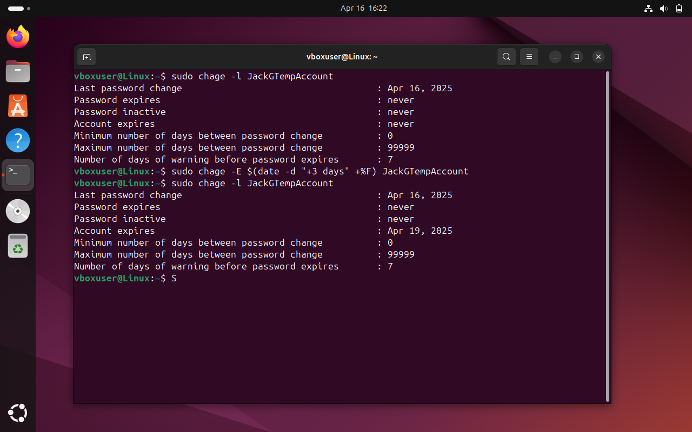

# Control 01 – Temporary User Accounts Expire ≤ 72 Hours

**Analyst:** Jack Grainger  
**Control Source:** STIG_Ubuntu_20  
**Security Control ID:** SV-238196r653763_rule  

---

## Control / Rule Title
The Ubuntu operating system must provision temporary user accounts with an expiration time of 72 hours or less.

## Checked Using
```bash
sudo chage -l <temp_user> | grep Expires
```
## Evidence

