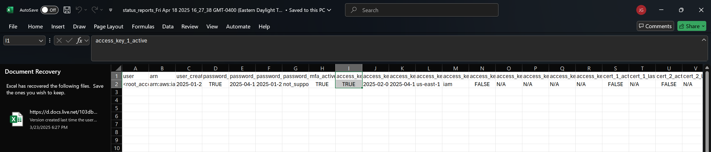
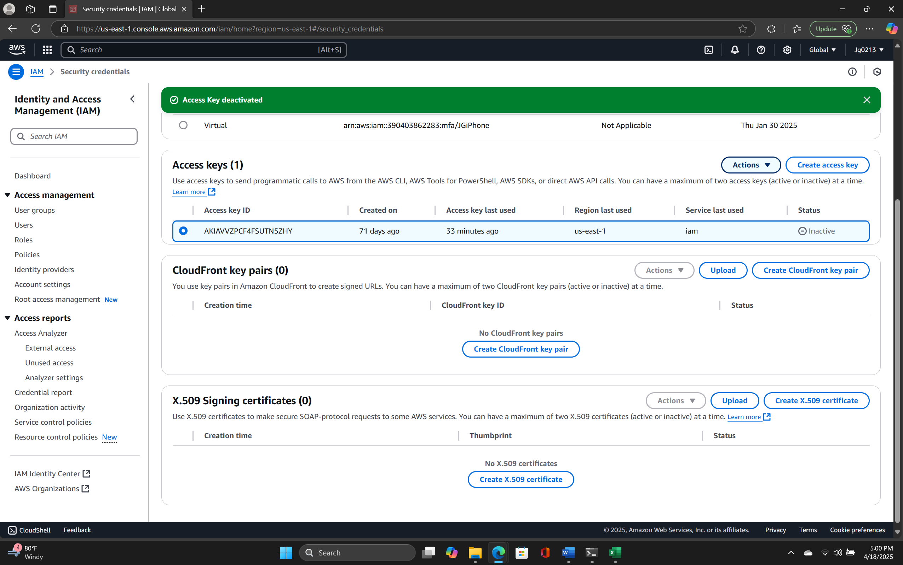

# Control 02 – Ensure No Root Account Access Key Exists

**Analyst:** Jack Grainger  
**Control Source:** CIS AWS Foundations v1.0.0 (pp. 27–28)  
**Security Control ID:** CCE-78910-7 (CIS CSC v6.0 #5.1)  

---

## Control / Rule Title
1.12 Ensure no root account access key exists.

## Checked Using
Downloaded the **Credential Report** from IAM dashboard.

## Fix / Remediation
Deactivated the active root access key from IAM dashboard.  
Recommended remediation: **Delete** root access keys completely.

## Additional Steps Required for Compliance
Deletion ensures permanent compliance, since deactivation allows reactivation.

## Comments
Credential report initially showed `access_key_1_active=true`.

## Evidence
  

