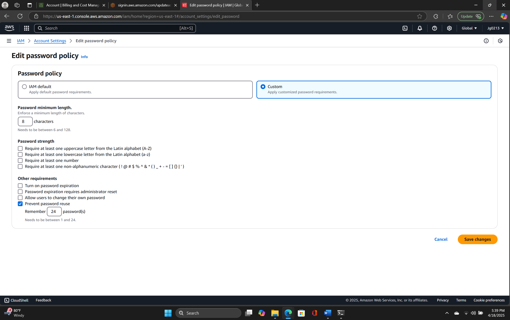

# Control 03 – IAM Password Policy Prevents Reuse

**Analyst:** Jack Grainger  
**Control Source:** CIS AWS Foundations v1.0.0 (p. 24)  
**Security Control ID:** CCE-78908-1  

---

## Control / Rule Title
1.10 Ensure IAM password policy prevents password reuse.

## Checked Using
Logged into IAM dashboard → Account settings → Custom settings → “Prevent password reuse” unchecked.

## Fix / Remediation
Set **Number of passwords to remember = 24** in AWS IAM console.

## Additional Steps Required for Compliance
Document change, enforce MFA, and monitor resets.

## Comments
Initially misconfigured; corrected per CIS standard.

## Evidence

