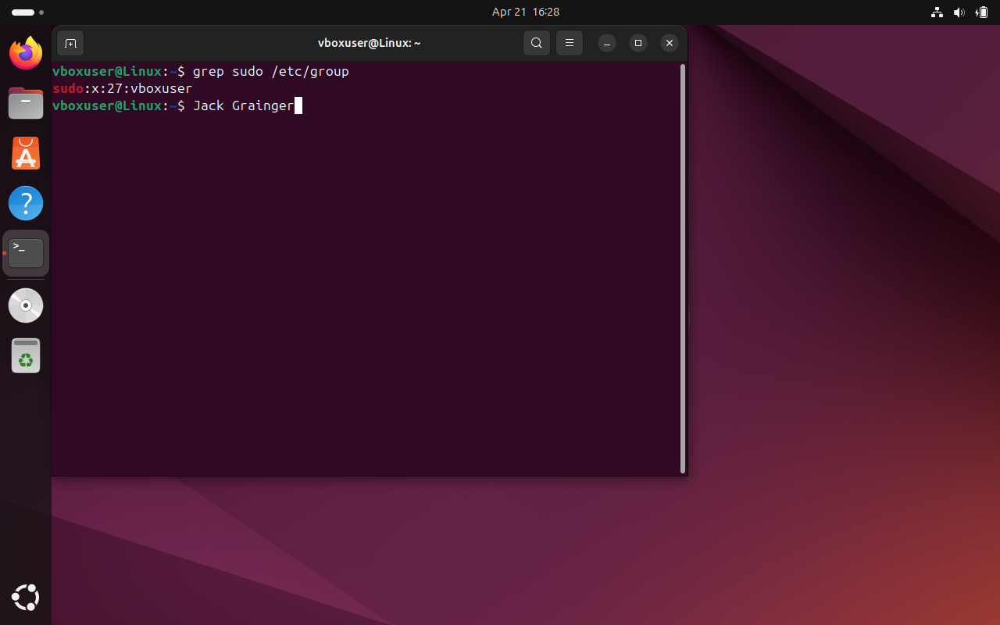

# Control 04 – Only Required Users in Sudo Group

**Analyst:** Jack Grainger  
**Control Source:** STIG_Ubuntu_20  
**Security Control ID:** SV-238206r653793_rule  

---

## Control / Rule Title
Ensure only required users are part of the sudo group.

## Checked Using
```bash
grep sudo /etc/group
```
## Evidence

