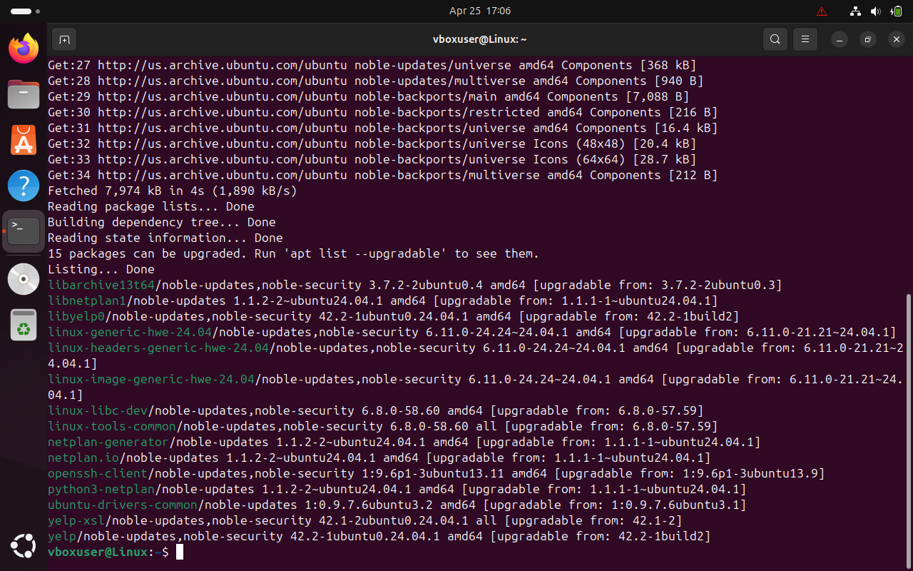

# Control 05 – Vulnerable & Outdated Components

**Analyst:** Jack Grainger  
**Control Source:** OWASP Top 10 (A06:2012)  

---

## Control / Rule Title
Detect and remediate outdated system components.

## Checked Using
```bash
sudo apt update && apt list --upgradable
```
## Evidence

