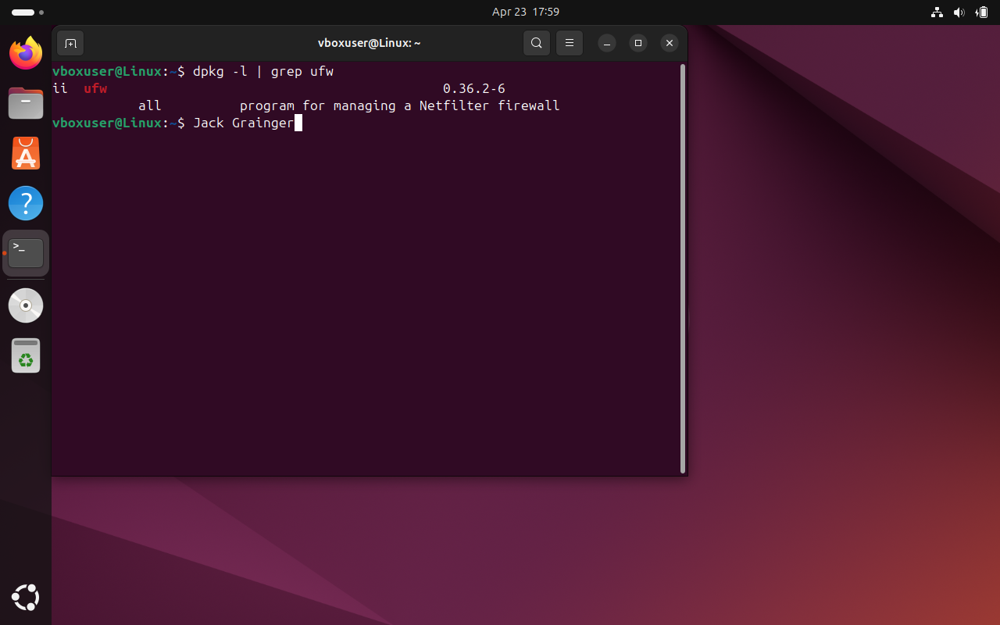

# Control 06 – Application Firewall Installed

**Analyst:** Jack Grainger  
**Control Source:** STIG_Ubuntu_20  
**Security Control ID:** SV-238354r853429_rule  

---

## Control / Rule Title
Ensure an application firewall is installed to control remote access methods.

## Checked Using
```bash
dpkg -l | grep ufw
```
## Evidence

