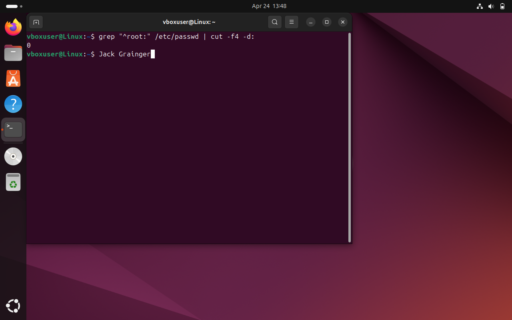

# Control 07 – Root Account GID 0

**Analyst:** Jack Grainger  
**Control Source:** CIS Ubuntu 22.04 LTS Benchmark (p. 716)  
**Security Control ID:** 5.5.3  

---

## Control / Rule Title
Ensure default group for root account is GID 0.

## Checked Using
```bash
grep "^root:" /etc/passwd | cut -f4 -d:
```
## Evidence

