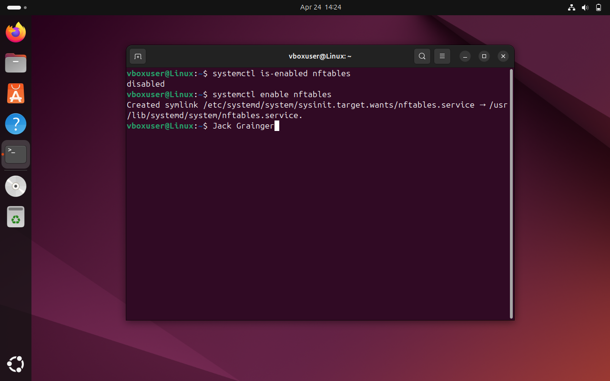

---

### 📄 `controls/control-08-nftables.md`
```markdown
# Control 08 – Ensure Nftables Service Enabled

**Analyst:** Jack Grainger  
**Control Source:** CIS Ubuntu 22.04 LTS Benchmark (p. 391)  
**Security Control ID:** 3.5.2.9  

---

## Control / Rule Title
Ensure nftables service is enabled.

## Checked Using
```bash
systemctl is-enabled nftables
```
## Evidence

