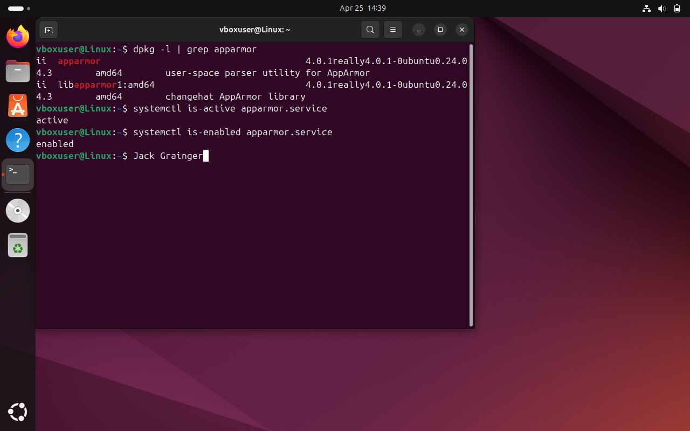

# Control 09 – Ensure AppArmor Configured

**Analyst:** Jack Grainger  
**Control Source:** STIG_Ubuntu_20  
**Security Control ID:** SV-238360r853435_rule  

---

## Control / Rule Title
The Ubuntu operating system must be configured to use AppArmor.

## Checked Using
```bash
dpkg -l | grep apparmor
systemctl is-active apparmor
systemctl is-enabled apparmor
```
## Evidence

