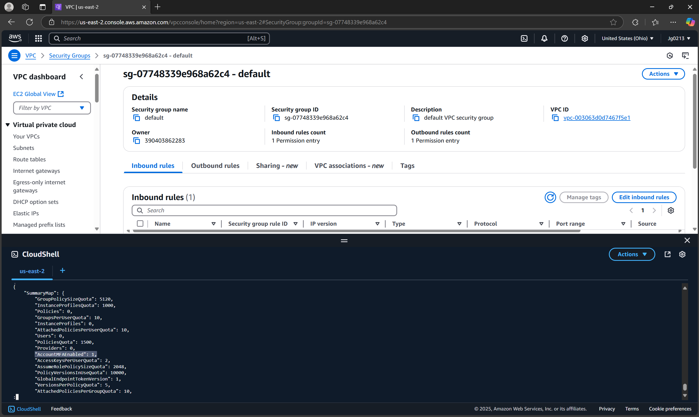

# Control 10 – Root Account Hardware MFA

**Analyst:** Jack Grainger  
**Control Source:** CIS AWS Foundations (p. 29)  
**Security Control ID:** 1.13  

---

## Control / Rule Title
Ensure hardware MFA is enabled for root account.

## Checked Using
```bash
aws iam get-account-summary
```
## Evidence

